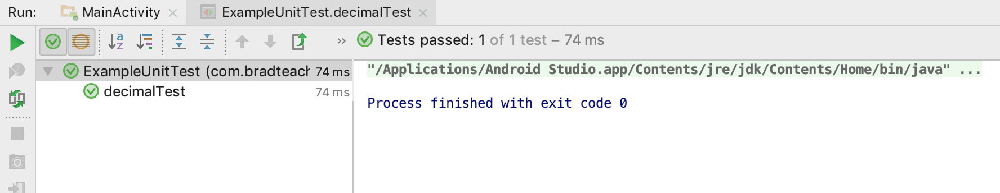
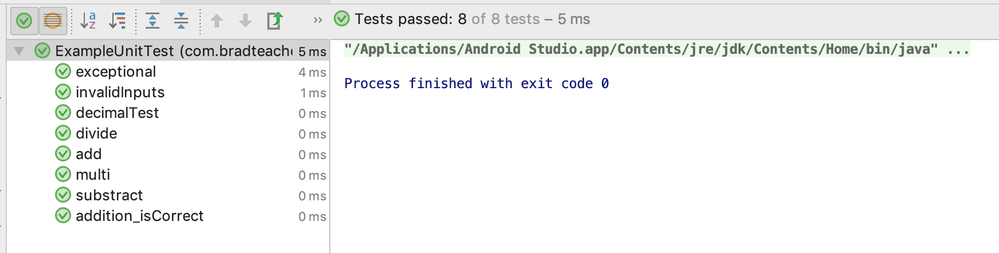
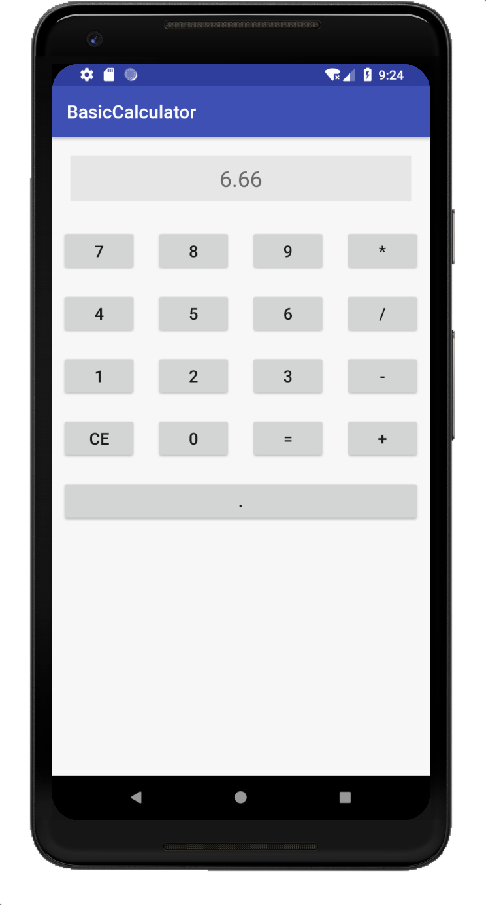

# Instruction for mp1

> 11510225 Yuxing Hu (胡与兴)

* Step3: adding JUnit Test checking for decimal points

  ```java
  /* Initial test for TDD */
      @Test
      public void decimalTest() {
          MainActivity mainActivity = new MainActivity();
          double number1 = 1.5, number2 = 3.0;
          assertEquals(4.5, mainActivity.add(number1, number2), delta);
      }
  ```

* Step 4: pass step 3

  ```java
  public double add(double number1, double number2) {
          return number1 + number2;
      }
  ```




* Step 5: refactoring

  ```java
  case "+":
  	//answerTV.setText("answer: " + (num1 + num2));
  	answerTV.setText("answer: " + add(num1, num2));
  break;
  ```

* Step 6: adding JUnit test

  ```java
  @Test
      public void add() {
          double number1 = 2.5, number2 = 3.0;
          assertEquals(5.5, mainActivity.add(number1, number2), delta);
      }
  
      @Test
      public void substract() {
          double number1 = 12.5, number2 = 3.0;
          assertEquals(9.5, mainActivity.substract(number1, number2), delta);
      }
  
      @Test
      public void multi() {
          double number1 = 1.5, number2 = 3.0;
          assertEquals(4.5, mainActivity.multi(number1, number2), delta);
      }
  
      @Test
      public void divide() {
          double number1 = 12.4, number2 = 3.1;
          assertEquals(4.0, mainActivity.divide(number1, number2), delta);
      }
  ```

* Step 7: complete logic for "."

  ```java
  private Button keyPadPoint;
  
  protected void onCreate(Bundle savedInstanceState) {
      keyPadPoint = findViewById(R.id.key_point_btn);
      keyPadPoint.setOnClickListener(this);
  }
  
  public void onClick(View view) {
      switch (view.getId()) {
          case R.id.key_point_btn:
                  number = number + ".";
                  answerTV.setText(number);
                  break;
      }
  }
  
  ```

* Step 8: checking behavior

  ```java
  public double divide(double number1, double number2) {
          if (number2 == 0) {
              throw new IllegalArgumentException();
          } else {
              return number1 / number2;
          }
      }
  
  @Test(expected = IllegalArgumentException.class)
      public void exceptional() {
          double number1 = 10.4, number2 = 0;
          assertEquals(4.0, mainActivity.divide(number1, number2), delta);
      }
  ```

* Step 9: invalid inputs

  ```java
  @Test(expected = NumberFormatException.class)
      public void invalidInputs() {
          double number1 = 10.4;
          String number2 = "abc";
          assertEquals(4.0, mainActivity.divide(number1, Double.parseDouble(number2)), delta);
      }
  ```

* Step 10: screenshots

  

  

