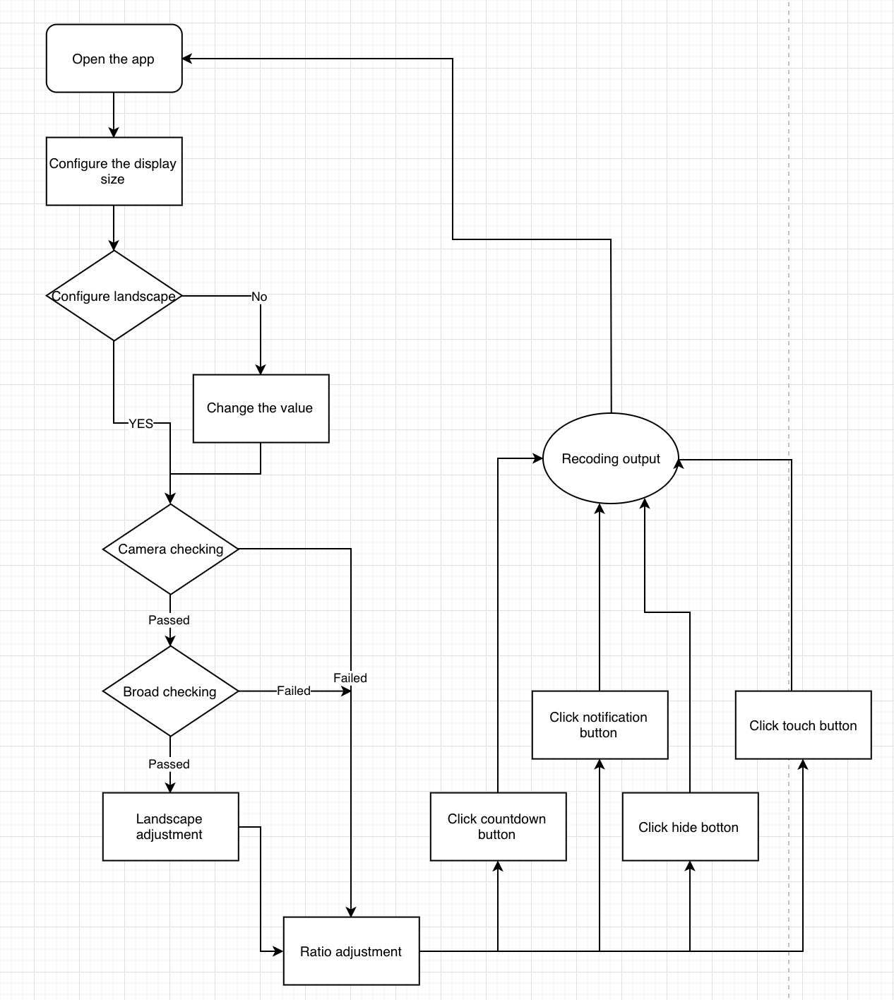
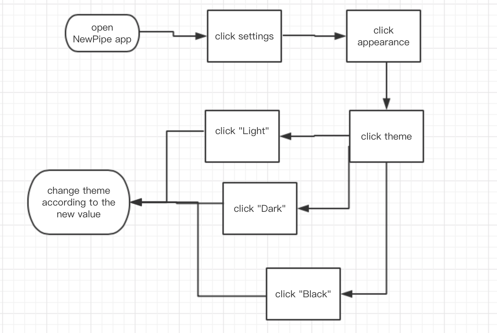
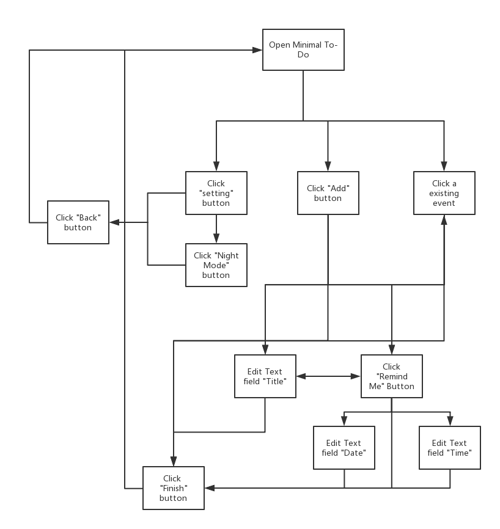
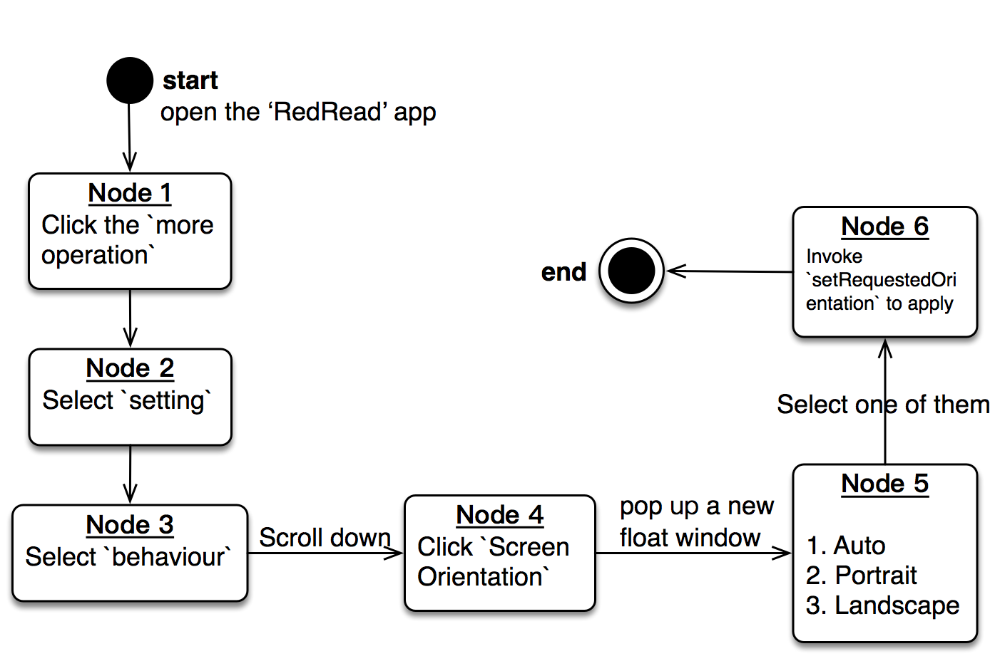

# Progress Report

## Group Name

* Exit Code 0

## Members

- 11510225 Yuxing Hu (胡与兴) [@lifesaver0129](https://github.com/lifesaver0129)
- 11510003 Sitong Liu (刘斯彤) [@Liu-Sitong](https://github.com/Liu-Sitong)
- 11510064 Lin Wang (王林) [@Hanswanglin](https://github.com/Hanswanglin)
- 11510255 Jingxin Wu (吴景新) [@JXWu](https://github.com/xwoooo)

## Open-source project

| Name             | Link                                       | Person in charge |
| ---------------- | ------------------------------------------ | ---------------- |
| **Telecine**     | https://github.com/JakeWharton/Telecine    | Yuxing Hu        |
| **Minimal-Todo** | https://github.com/avjinder/Minimal-Todo   | Sitong Liu       |
| **RedReader**    | https://github.com/QuantumBadger/RedReader | Lin Wang         |
| **NewPipe**      | https://github.com/TeamNewPipe/NewPipe     | Jingxin Wu       |


## Telecine (Yuxing Hu 11510225)

### 1. JUnit test cases at the GUI level

#### a. Selected method

```java
static RecordingInfo calculateRecordingInfo(int displayWidth, int displayHeight,
       boolean isLandscapeDevice, int cameraWidth, int cameraHeight) {
    if (cameraWidth == -1 && cameraHeight == -1) {
      // No cameras. Fall back to the display size.
      return new RecordingInfo(displayWidth, displayHeight);
    }

    int frameWidth = isLandscapeDevice ? cameraWidth : cameraHeight;
    int frameHeight = isLandscapeDevice ? cameraHeight : cameraWidth;
    if (frameWidth >= displayWidth && frameHeight >= displayHeight) {
      // Frame can hold the entire display. Use exact values.
      return new RecordingInfo(displayWidth, displayHeight);
    }

    // Calculate new width or height to preserve aspect ratio.
    if (isLandscapeDevice) {
      frameWidth = displayWidth * frameHeight / displayHeight;
    } else {
      frameHeight = displayHeight * frameWidth / displayWidth;
    }
    return new RecordingInfo(frameWidth, frameHeight);
  }
```

#### b. Construct test on GUI level

* Unfortunately this method can not be constructed at the GUI level. 
* The reason is that this method take the devices configuration as inputs, such as the display pixel and actually camera width. What's more, it will automatically check if the device could support landscape view, which require a 18:9 ratio of display. Since I don't have much (or any) Android devices and this requirements is beyond the original purpose of GUI test, this test can not be deployed.
* Hand-written test cases:
  * Open up a landscape device => Set display width equals to 1920 and height equals to 1080 => Set camera width equals to 1920 and height equals to 1080 => Call the method => calculateRecordingInfo method retrun new Recording Info (1920, 1080). 
  * Open up a non landscape device => Set display width equals to 2160 and height equals to 3840 => Set camera width equals to 1920 and height equals to 1080 => Call the method => calculateRecordingInfo method retrun new Recording Info (1080, 1920). 
  * Open up a landscape device => Set display width equals to -10 and height equals to -10 => Set camera width equals to -1 and height equals to -1 => Call the method => calculateRecordingInfo method retrun new Recording Info (-10, -10). 

### 2. Event flow graph



#### a. Construct 2 test cases

* Open up the telecine app => Configure it's a landscape screen => Set display width equals to 1920 and height equals to 1080 => Set camera width equals to 1920 and height equals to 1080 => Checking the broad is able to convert the sight => No need to adjust the landscape => Adjust the ration to 100% => Click the countdown button => Start to record
* Open up the telecine app => Configure it's a not a landscape screen => Set display width equals to 1080 and height equals to 1920 => Set camera width equals to 2160 and height equals to 3840 => Checking the broad is not able to convert the sight => Adjust the landscape to it favor size=> Adjust the ration to 50% => Click the notification button => Start to record

### 3. Two clauses method

#### a. Source codes

```java
 @Override
  protected void log(int priority, String tag, String message, Throwable t) {
    message = System.currentTimeMillis() + " " + priorityToString(priority) + " " + message;
    synchronized (buffer) {
      buffer.addLast(message);
      if (buffer.size() > BUFFER_SIZE) {
        buffer.removeFirst();
      }
    }
    if (t != null && priority == Log.ERROR) {
      Bugsnag.notify(t);
    }
  }
```

#### b. Predicate coverage 

* Simplify the cluse: `t != null && priority == Log.ERROR`
  * a: t != null
  * b: priority == Log.ERROR
  * p = a && b
* Make p = true: a = true, b = true
* Make p = false: 
  * a=true, b=false
  * a=false, b=true
  * a=false, b=false

* Test cases:
  * Create project => Call log function => Transfer into a not null Throwable value t => Set priority value equals to Log.ERROR => get the Bugsnag.notify(t) => End
  * Create project => Call log function => Transfer into a null Throwable value t => Set priority value equals to Log.ERROR => get nothing => End

### 4. Compare the methods

#### a. Most useful to find new bugs

* After we fiercely disscussion, we draw the conclusion that graph coverage method is most useful to find new bug.
* The reason is that the other two method is trying to find new bug at method level r/ea/ther than program level. A program is made up of hundreds of methods and it's very promising that we couldn't find bug in a specific method. However, when it comes to the program it's another story. If we need a program to work well, every method within it must be correct.

#### b. Comparing input domain modeling and logic coverage 

* We suppose that input domain modeling is esaier to crate GUI test.
* The reason is that GUI test require we to click buttons and set up numbers from the interface of the program. Domain modeling create several inputs sets that can be easily checked whether they can be typed in or not. However logic coverage is result based method and some combination may not easily set in.

## NewPipe (Jingxin Wu 11510255)

### 1. JUnit test cases at the GUI level

#### a. Selected method

```java
private final Preference.OnPreferenceChangeListener themePreferenceChange = new Preference.OnPreferenceChangeListener() {
    @Override
    public boolean onPreferenceChange(Preference preference, Object newValue) {
        defaultPreferences.edit().putBoolean(Constants.KEY_THEME_CHANGE, true).apply();
        defaultPreferences.edit().putString(getString(R.string.theme_key), newValue.toString()).apply();

        if (!newValue.equals(startThemeKey) && getActivity() != null) {
            // If it's not the current theme
            getActivity().recreate();
        }

        return false;
    }
}
```

#### b. Construct test on GUI level

- To fullfilled ECC,  one hand-written test case is needed:
  - Open up a device => Follow settings-appearance-theme  to open a popup => Select Light theme =>  Call the method => The theme of appearance becomes light


### 2. Event flow graph



#### a. Construct 2 test cases

* Open up a device => Follow settings-appearance-theme  to open a popup => Select Light theme =>  Call the method => The theme of appearance becomes light
* Open up a device => Follow settings-appearance-theme  to open a popup => Select Black theme =>  Call the method => The theme of appearance becomes black

### 3. Two clauses method

#### a. Source codes

```java
 private String trim(final String input) {
        if (input == null || input.length() < 1) {
            return input;
        } else {
            String output = input;
            while (output.length() > 0 && output.substring(0, 1).matches(REGEX_REMOVE_FROM_URL)) {
                output = output.substring(1);
            }
            while (output.length() > 0
                    && output.substring(output.length() - 1, output.length()).matches(REGEX_REMOVE_FROM_URL)) {
                output = output.substring(0, output.length() - 1);
            }
            return output;
        }
    }
```

#### b. Predicate coverage 

- Simplify the cluse: `input != null || input.length() < 1 `
  - a: input != null
  - b: input.length() < 1
  - p = a || b
- Make p = false: a = false, b = false
- Make p = false: 
  - a=true, b=true
  - a=false, b=true
  - a=true, b=true
- Test cases:
  - create project => call trim function => set input into null => get the output which is same as input => End
  - create project => call trim function => set input into "sss" => get the output "sss" => End

### 4. Compare the methods

#### a. Most useful to find new bugs

- After we fiercely disscussion, we draw the conclusion that graph coverage method is most useful to find new bug.
- The reason is that graph coverage find bugs at program level while input modeling model and logic coverage focus on method level. Sometimes a bug is related to so many methods that it's difficult to find it at a specific method. Additonally, a program can be consist of thousands of methods, which make it a hard work to test them individually. On the contray, if we verify that the program is working correctly at program level, it's likely that methods it contains is fine.

#### b. Comparing input domain modeling and logic coverage 

- We suppose that input domain modeling is esaier to create GUI test.
- The reason is that GUI test require us to capture user interactions. Input domain modelling make it easy to examine the test input clearly by providing various input set. But if we adapt logic coverage, we have to construct some combinations that it's difficult to satisfy because it is a result based method.


## Minimal-Todo (Sitong Liu 11510003)

### 1. JUnit test cases at the GUI level
#### a)  

```java
private void setAlarms() {
    if (mToDoItemsArrayList != null) {
        for (ToDoItem item : mToDoItemsArrayList) {
            if (item.hasReminder() && item.getToDoDate() != null) {
                if (item.getToDoDate().before(new Date())) {
                    item.setToDoDate(null);
                    continue;
                }
                Intent i = new Intent(getContext(), TodoNotificationService.class);
                i.putExtra(TodoNotificationService.TODOUUID, item.getIdentifier());
                i.putExtra(TodoNotificationService.TODOTEXT, item.getToDoText());
                createAlarm(i, item.getIdentifier().hashCode(), item.getToDoDate().getTime());
            }
        }
    }
}
```

#### b)

##### test case 1

"Click button Add" -> "Edit Text field with Title=test event 1"  -> "Click button Remind Me" -> "Edit Text field with date=15 Nov, 2050" -> "Edit Text field with time=12:00 AM" -> "Click button Finish"

##### test case 2

"Click button Add" -> "Edit Text field with Title=test event 2" -> "Click button Finish"


### 2. Event flow graph



#### a)

##### test case 1

"Open Minimal To-Do" -> "Click button Add" -> "Edit Text field with Title=test event"  -> "Click button Remind Me" -> "Edit Text field with date=15 Nov, 2050" -> "Edit Text field with time=12:00 AM" -> "Click button Finish" -> "Click existing event 'test event'" -> "Edit Text field with date=15 Nov, 2052" -> "Click button Finish" 

##### test case 2

"Open Minimal To-Do" -> "Click button Setting" -> "Click button Night Mode" -> "Click button Back"


### 3. Two clauses method

#### a)

```java
    private void setAlarms() {
        if (mToDoItemsArrayList != null) {
            for (ToDoItem item : mToDoItemsArrayList) {
                if (item.hasReminder() && item.getToDoDate() != null) {
                    if (item.getToDoDate().before(new Date())) {
                        item.setToDoDate(null);
                        continue;
                    }
                    Intent i = new Intent(getContext(), TodoNotificationService.class);
                    i.putExtra(TodoNotificationService.TODOUUID, item.getIdentifier());
                    i.putExtra(TodoNotificationService.TODOTEXT, item.getToDoText());
                    createAlarm(i, item.getIdentifier().hashCode(), item.getToDoDate().getTime());
                }
            }
        }
    }
```

**a**: item.hasReminder()

**b**: item.getToDoDate() != null

**p** = **a** && **b**

#### b)

##### test case 1  (p = false)

"Open Minimal To-Do" -> "Click button Add" -> "Edit Text field with Title=test event"  -> "Click button Remind Me" -> "Edit Text field with date=15 Nov, 2050" -> "Edit Text field with time=12:00 AM" -> "Click button Finish"

##### test case 2  (p = true)

"Open Minimal To-Do" -> "Click button Add" -> "Edit Text field with Title=test event" -> "Click button Finish"

### 4. Discussion

#### a)

After our group discussion, we consider that the graph coverage method is the most useful in finding new bugs. Graph coverage focuses on program level so it is more likely to find bugs that would occur in the user usage process. Some bugs can be complicate and unexpected, so input modeling model and logic coverage, which focus on method level, would miss them. On the other hand, with graph coverage, test case can make sure all the paths work well, and all related methods tend to work well too.

#### b)

We think that input domain modeling is the most effective in constructing test cases at GUI level. Input domain modeling is more directly related to user input, so it is easier for us to construct input set. Also, it can be adapted in more cases, while logic coverage is hard to be employed in many cases because many methods do not contain predicates required. 


## RedRead (Lin Wang 11510064)

### 1. JUnit test cases at the GUI level

#### a. Selected method

```java
/**
 * method in app perferences to set the orientation of view.
 * three option: Auto, Portrait, Landscape.
 */
private void setOrientationFromPrefs() {
  PrefsUtility.ScreenOrientation orientation = PrefsUtility.pref_behaviour_screen_orientation(this, sharedPreferences);
  if (orientation == PrefsUtility.ScreenOrientation.AUTO)
    setRequestedOrientation(ActivityInfo.SCREEN_ORIENTATION_UNSPECIFIED);
  else if (orientation == PrefsUtility.ScreenOrientation.PORTRAIT)
    setRequestedOrientation(ActivityInfo.SCREEN_ORIENTATION_PORTRAIT);
  else if (orientation == PrefsUtility.ScreenOrientation.LANDSCAPE)
    setRequestedOrientation(ActivityInfo.SCREEN_ORIENTATION_LANDSCAPE);
}
/**
 * a related enum.
 */
public enum ScreenOrientation {
    AUTO, PORTRAIT, LANDSCAPE
  }

/**
 * another part for invoking method.
 */
public static ScreenOrientation pref_behaviour_screen_orientation(final Context context, final SharedPreferences sharedPreferences) {
    return ScreenOrientation.valueOf(General.asciiUppercase(getString(R.string.pref_behaviour_screenorientation_key, ScreenOrientation.AUTO.name(), context, sharedPreferences)));
  }
```
#### b. Construct test on GUI level
* function description: three optional buttons could be applied. Auto, Portrait, Landscape are three mode for `Orientation`, which will invoke internal api `setRequestedOrientation` to implement it.
* GUI test. From the interface of Android phone, there are three button as input to test:
  - Auto: the orientation of interface follow the system setting of Android phone.
  - PORTRAIT: mandatory action to make the orientation of interface as portrait.
  - LANDSCAPE: mandatory action to make the orientation of interface as landscape.
* test case:
  - open **RedRead** => click the **more operation** icon button => select **setting** => select **behaviour** => click **Screen Orientation** => click **Auto** Radio button.
  - open **RedRead** => click the **more operation** icon button => select **setting** => select **behaviour** => click **Screen Orientation** => click **Portrait** Radio button.
  - open **RedRead** => click the **more operation** icon button => select **setting** => select **behaviour** => click **Screen Orientation** => click **Landscape** Radio button.

### 2. Event flow graph



#### a. Construct 2 test cases
because the input comes from the `content` user provide. The test could be regraded as the paramenter `PrefsUtility.ScreenOrientation`
* open **RedRead** => click the **more operation** icon button => select **setting** => select **behaviour** => click **Screen Orientation** => click **Auto** Radio button => `PrefsUtility.ScreenOrientation` = `Auto`.
* open **RedRead** => click the **more operation** icon button => select **setting** => select **behaviour** => click **Screen Orientation** => click **Portrait** Radio button => `PrefsUtility.ScreenOrientation` = `Portrait`.

### 3. Two clauses method

#### a. Source codes
```java
private void openCustomLocation(String[] typeReturnValues, Spinner destinationType, AutoCompleteTextView editText) {

  final String typeName = typeReturnValues[destinationType.getSelectedItemPosition()];

  switch(typeName) {
          case "subreddit": {

              final String subredditInput = editText.getText().toString().trim().replace(" ", "");

              try {
                  final String normalizedName = RedditSubreddit.stripRPrefix(subredditInput);
                  final RedditURLParser.RedditURL redditURL = SubredditPostListURL.getSubreddit(normalizedName);
                  if(redditURL == null || redditURL.pathType() != RedditURLParser.SUBREDDIT_POST_LISTING_URL) {
                      General.quickToast(this, R.string.mainmenu_custom_invalid_name);
                  } else {
                      onSelected(redditURL.asSubredditPostListURL());
                  }
              } catch(RedditSubreddit.InvalidSubredditNameException e){
                  General.quickToast(this, R.string.mainmenu_custom_invalid_name);
              }
              break;
          }

          case "user":
        //more code
  }
}

// another class
public static final int SUBREDDIT_POST_LISTING_URL = 0;

// pathType() is an @interface
public @interface PathType {}
```

```xml
<!-- In string.xml file -->
<string name="mainmenu_custom_invalid_name">Invalid subreddit name.</string>
```
#### b. Predicate coverage
* Simplify the cluse: `redditURL == null || redditURL.pathType() != RedditURLParser.SUBREDDIT_POST_LISTING_URL`
  * a: `redditURL == null`
  * b: `redditURL.pathType() != RedditURLParser.SUBREDDIT_POST_LISTING_URL`
  * p: `a || b`
* Make p = true:
  * a = true, b = true
  * a = true, b = false
  * a = false, b = true
* Make p = false:
  * a = false, b = false

* Test cases:
  * click the **Custom Location** => default select the **Subreddit** option => input nothing => click **Go** => `General.quickToast(this, R.string.mainmenu_custom_invalid_name)` execute => **Invalid subreddit name** pop up => End
  * click the **Custom Location** => default select the **Subreddit** option => input **"art"** in the text field => click **Go** => `onSelected(redditURL.asSubredditPostListURL())` execute => a new **Subreddit** page appear => End

### 4. Compare the methods

#### a) Which method is the most useful in finding new bugs? Why?

**graph coverage**
After our group discussion, we all think that it is more possible to find a new bug by the graph coverage method rather than others. Not only input space modeling, the logic coverage are some methods focus on specified function as well. It is really hard to cover all parameters when **ISP** used and exist all predicates for some logic statements when **logic coverage** used.    
Simultaneously, the core of finding new bug should be considered as finding a situation which will make it crashed or wrong output. **graph coverage** is something could be applied in single method or even a special event program. In the graph coverage, we can go through every step according to the node and edges, which will traverse all situation and get the new bug if possible.

#### b) Comparing input domain modeling and logic coverage, which method is the most effective in constructing test cases at the GUI level?

**Input Domain Modeling**
However, it must be more effective to construct test case by **ISP** for it is Android Test. Android Test is kind of "Interface Test", so we feel it is easy to construct test cases by operate the interface. And for logic coverage, there always some variable situations which hard to fullfill from the interface, they are internal-used-variable.


