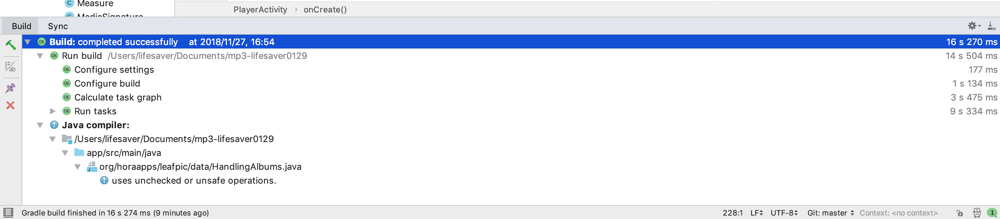

# mp3-monkey

* 11510225 Yuxing Hu (胡与兴)

### 1. Instrument the callback of all the event listeners

### 2. Compile the modified app



### 3. Run monkey 

#### Seed=923, throttle=2

* Full command:

  ```
  adb shell monkey -p org.horaapps.leafpic.debug -v 1000 -s 923 --throttle 2 > seed923sleep2.log
  ```

* No, there's no crash or error. The throttle is pretty fast and in this case I'm not able to switch between every two dots and when it when somewhere wrong it's hard to recover back to normal state.

#### Seed=256, throttle=10

* Full command

```
adb shell monkey -p org.horaapps.leafpic.debug -v 1000 -s 256 --throttle 10 > seed256speed10.log
```

* No, there's no crash or error. If throttle equals to 10 then it's pretty low and it will be a waste of time if the doting case is too many.

### 4. Delta debugging

There's no crash in my program.